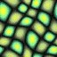
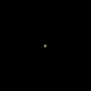
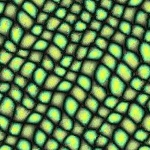
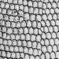
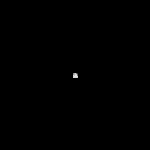
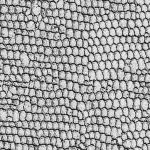
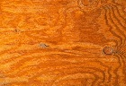
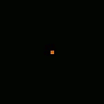
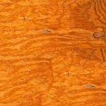

# Texture Synthesis by Non-parametric Sampling

This project implements Efros and Leung's 'Texture Synthesis by Non-parametric Sampling' (1999).

The algorithm synthesizes a new texture from an existing input by sampling the center pixel from a local neighborhood of the sample that best "matches" a local neighborhood in the current state of the synthesized texture.

## Usage

`python synthesis.py --sample_path=<input_path> --out_path=[output_path] --window_height=[win_height] --window_width=[win_width] --kernel_size=[ksize] --visualize`

* `input_path` - Path to the input texture sample.
* `output_path` - (Optional) Output path for the synthesized texture.
* `win_height` - (Optional) Height of the synthesized texture. 50 pixels is the default.
* `win_width` - (Optional) Width of the synthesized texture. 50 pixels is the default.
* `ksize` - (Optional) Width of a square synthesis kernel. Each synthesized pixel value is selected by computing a distance metric between local neighborhoods of height and width `ksize` between the current state of the synthesized texture and the input texture sample. 11 pixels is the default, but this value can be raised (lowered) to increase (decrease) the regularity of the synthesized texture.
* `visualize` - (Optional) Visualize an in-progress texture synthesis.

## Dependencies

* Python - Tested on version 3.7.0
* OpenCV - Tested on version 3.4.1
* NumPy - Tested on version 1.15.0

## Results

The following are selected results of this procedure. The leftmost column contains input texture samples and the rightmost column contains output synthesized textures. The middle column shows the completion of "layers" of the synthesis process.

| 
 Input Sample 
 | 
 Synthesis Process 
 | 
 Output Texture 

| ------------ | ------------- | --------------
| 
  
 | 
  
 | 
  

| 
 
 | 
  
 | 
  

| 
 
 | 
  
 | 
  
